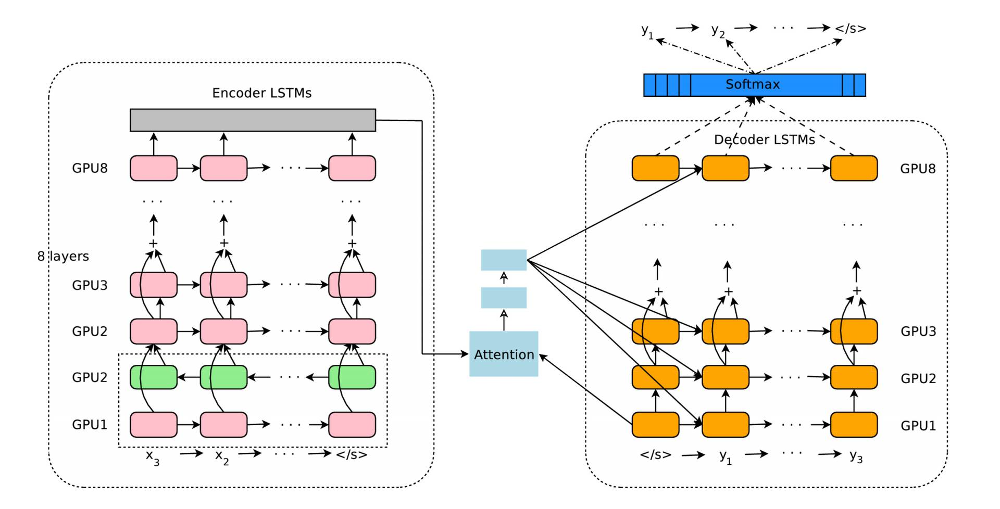
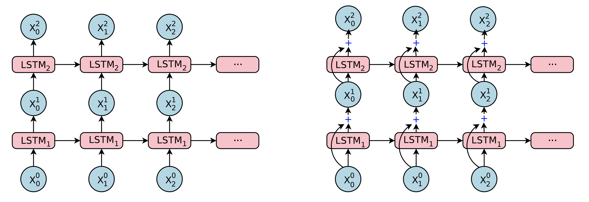

##   論文出處 : [Google’s Neural Machine Translation System - Bridging the Gap between Human and Machine Translation](https://arxiv.org/abs/1609.08144) 

會決定以整理這篇論文為這個網站的開頭，是因為這篇是我一年前進入李宏毅老師的實驗室做專題研究時看的第一篇論文。在這篇論文也用到的幾個經典的基本DL常用在NLP領域的架構，像是Seq2seq的模型、attention mechanism以及multi-layer LSTM，個人認為非常適合初學者學習。在這邊我主要紀錄幾個重要的部分幫助快速理解，如果有其他部分有問題也歡迎討論。

閱讀這篇前需要的背景知識：
*   DNN
*   RNN
*   LSTM

## Model Architecture

### Encoder-Decoder Architecture
GNMT的架構，就是經典的seq2seq架構。在seq2seq中，主要可以分成兩個部分：Encoder, Decoder。 顧名思義就是把輸入的句子“Encode"到某一些足以代表原句資訊的vector，再利用這些vector"Decode"出我們要的輸出。而Encoder和Decoder都常會使用RNN來實現，像是LSTM, GRU等等。

首先定義 $$ X,Y $$ 為source sentence和target sentence。可以想成$$X$$是要被翻譯的句子，而$$Y$$是$$X$$被翻譯後的結果。其中，$$X = x_1,x_2,......,x_M$$，代表著來自source sentence的$$\rm M$$個字; $$Y = y_1,y_2,....,y_N$$，代表著來自target sentence的N個字。

$$ \textbf x_1, \textbf x_2, ..., \textbf x_{\rm M} = EncoderRNN(x_1, x_2, x_3, ..., x_M) \quad \quad \quad (1)$$ 

在(1)式中，會將source sentence中的$$\rm M$$個字：$$x_1,x_2,......,x_M$$當作Encoder的輸入。通常在實作的時候會先把每個字轉成一個vector，我們稱這個動作叫作word embedding。在每個time step: $$i$$，將$$x_i$$的word vector輸入RNN，而RNN則會輸出$$\textbf x_{\rm i}$$這個vector。依此類推，經過$$\rm M$$個time step會生成$$ \textbf x_1,  \textbf x_2, ...,  \textbf x_{\rm M}$$共$$\rm M$$個vector。

我們的目標是在source sentence輸入後，可以得到target sentence，也就是$$Y$$。當我們輸入某一個句子時，我可能可以翻譯成好幾個句子，其中可能有幾個是正確答案，可能有幾個是亂翻翻錯的句子。由於要使用end-to-end的方式training，要使整個過程是可以算出gradient的，有一個常用的方法是使輸出端是一個機率分佈，而我們選擇機率最大的當作最終輸出。而每個$$Y$$機率計算的方式就如(2)式。

$$ P(Y|X) = P(Y|\textbf x_1, \textbf x_2, ..., \textbf x_{\rm M}) = \displaystyle\prod_{i=1}^{N} P(y_i|y_0,y_1,y_2,...,y_{i-1};\textbf x_1, \textbf x_2, ..., \textbf x_{\rm M}) \quad \quad \quad (2) $$

(2)式是條件機率式，意義上就是當輸入是$$X$$時，輸出為$$Y$$的機率為何。
$$P(y_i|y_0,y_1,y_2,...,y_{i-1};\textbf x_1, \textbf x_2, ..., \textbf x_{\rm M})$$代表著$$Y$$中第$$i$$個字$$y_i$$的機率。而$$Y$$的機率就是把每個$$y_i$$的機率相乘後得到。$$y_i$$是在Decoder的部分的每個time step $i$得到。當然，我們最後想得到的$$Y$$就是算出來機率最大的。

### Attention Mechanism

一般來說提到Attention Mechanism，就是Dzmitry Bahdanau在2014的論文[
Neural Machine Translation by Jointly Learning to Align and Translate](https://arxiv.org/abs/1409.0473)，以及Minh-Thang Luong在2015提出的[Effective Approaches to Attention-based Neural Machine Translation](https://arxiv.org/abs/1508.04025)中所提到的機制。

這個機制主要的目的：在一個句子中，對於理解其語意，每個字的重要程度並不相同，所以藉由這個機制，可以讓model可以在不同time step對於source sentence的每個字有不同的權重。以下舉個例子說明:

註：&#60; SOS &#62;, &#60; EOS &#62;是實際在實作時，分別代表"start of sequence"和"end of sequence"，用意是讓model知道這是一句話的開頭或是結尾。

source sentence : &#60; SOS &#62; Where are you ? &#60; EOS &#62;

當要翻譯這句話到中文“你在哪？”，在decoder的地方，第一個time step就是output出“你”這個字，而在這個時間點，"you"這個字顯然對於這個中文翻譯是更重要一點的;而“哪”則是會比較看重"where"這個字，以此類推。

$$ s_t = AttentionFunction(\textbf y_{i-1}, \textbf x_{\rm t}) \quad \forall t, \quad 1 \leq t \leq M \quad\quad\quad(3)$$

$$ p_t = \frac {exp(s_t)}{\displaystyle\sum_{i=1}^{M} exp(s_t)} \quad \forall t, \quad 1 \leq t \leq M \quad\quad\quad(4)$$

$$ \textbf a_i = \sum_{t=1}^{M} p_t \cdot  \textbf x_{\rm t} \quad\quad\quad(5)$$

上述公式中的$$\textbf y_{i-1}$$是Decoder在第$$i-1$$個time step的output(hidden state)。式(3)代表在Decoder的time step $$i$$時，利用feed forward network，把$$\textbf y_{i-1}$$對每個Encoder的$$\textbf x_{\rm t}$$計算出$$s_t$$。$$s_t$$代表著$$\textbf x_{\rm t}$$在Decoder的這個time step $$i$$所佔的權重。
接著利用式(4)，將得到的$$M$$個權重分數$$s_t$$做標準化得到$$p_t$$，使分數總和為1。
最後，把$$\textbf x_{\rm t}$$利用$$p_t$$加權加總，得到 $$\textbf a_i$$。
通常我們稱這個$$\textbf a_i$$為Decoder在第$$i$$個time step的 "context vector"（內文稱作Attention context）。可以把context vector理解為，Decoder在這個時間點理解到的輸入資訊。

Figure 1 

Figure 1 是GNMT的架構總覽，左方區塊是Encoder，右方區塊是Decoder，而中間是Attention Module。
在Encoder的部分，粉紅色是順著時間軸方向的RNN架構;而在第一層的地方有綠色的部分，綠色部分則是反向的架構。而我們通常稱第一層這種把雙向RNN接起來的架構稱為：Bi-directional RNN。

### Residual Connections
在許多實作中發現，deep stacked LSTMs（如下）往往比單層的架構還要好。但是如果只是單純加深架構，因為exploding gradient和 vanishing gradient的問題，往往會造成訓練上的困難。故google提出一種改良方式：Residual Connection。

Figure 2

在Figure 2中，左邊是一般的deep stacked LSTMs;右邊是具有Residual Connection的架構。其實唯一的差別就是在第2層以後的LSTM的input除了有上一層LSTM的output（也就是hidden state）$$\textbf m$$之外，還外加上一層LSTM的input $$\textbf x$$，可以理解為希望讓上一層的input資訊不會因為經過上一層的LSTM運算後而難以傳達到這一層。其中$$\textbf c$$代表LSTM的cell state(memory state)，上標$$i$$代表第幾層LSTM，下標$$t$$代表第幾個time step。

沒有Residual Connection的計算方式如下：

$$ \textbf c_{t}^{i}, \textbf m_{t}^{i} = {\rm LSTM}_i(\textbf c_{t-1}^{i}, \textbf m_{t-1}^{i}, \textbf x_{t}^{i-1}; \textbf W^i)$$

$$\textbf x_{t}^{i} = \textbf m_{t}^{i}$$

$$ \textbf c_{t}^{i+1}, \textbf m_{t}^{i} = {\rm LSTM}_{i+1}(\textbf c_{t-1}^{i+1}, \textbf m_{t-1}^{i+1}, \textbf x_{t}^{i}; \textbf W^{i+1})$$

具有Residual Connection的計算方式如下：

$$ \textbf c_{t}^{i}, \textbf m_{t}^{i} = {\rm LSTM}_i(\textbf c_{t-1}^{i}, \textbf m_{t-1}^{i}, \textbf x_{t}^{i-1}; \textbf W^i)$$

$$\textbf x_{t}^{i} = \textbf m_{t}^{i}+ \textbf x_{t}^{i-1}$$  

$$ \textbf c_{t}^{i+1}, \textbf m_{t}^{i} = {\rm LSTM}_{i+1}(\textbf c_{t-1}^{i+1}, \textbf m_{t-1}^{i+1}, \textbf x_{t}^{i}; \textbf W^{i+1})$$

## Training Criteria
在end to end的語言生成模型中，常使用 maximum-likelihood 做訓練目標，而maximum-likelihood等價於minimize negative log likelihood (NLL)，實際在訓練時常常以NLL當作loss function。首先定義：

給定$$N$$筆input-output pairs的dataset $${\mathcal D}\equiv \left\{ (X^{(i)}, Y^{(*i)}) \right\}_{i=1}^{N}$$，其中$$Y^{(*i)}$$是ground truth的output target。

以下為maximum-likelihood的公式：

$${\mathcal O}_{\rm ML}(\pmb \theta) = \sum_{i=1}^{N} {\rm log} P_{\theta}(Y^{*(i)}|X^{(i)})$$

這個公式主要是希望decoder輸出的機率分佈可以和ground truth越接近越好，詳細數學理論可以參考information theory的information entropy之類的資料文獻，在此不贅述。

但是，單純只用上述公式，會有以下問題：
*   在training的時候都是輸入ground truth, 並未考慮到錯誤的output。
*   BLEU score高的ouput應該有更高的機率

所以，在這邊引入Reinforcement method : 計算出$$r(Y,Y^{*(i)})$$來加強訓練，公式如下：

$${\mathcal O}_{\rm RL}(\pmb \theta) = \sum_{i=1}^{N} \sum_{Y\in {\mathcal Y}} P_{\theta}(Y|X^{(i)})r(Y,Y^{*(i)})$$

其中
$$\displaystyle \sum_{Y\in {\mathcal Y}} P_{\theta}(Y|X^{(i)})r(Y,Y^{*(i)})$$我在這邊理解成：在某一個輸入$$X^{(i)}$$時，對在一定長度內的所有可能的輸出$$Y$$計算出$$r(Y,Y^{*(i)})$$的期望值。目標就是希望這個分數的期望值越大越好。其中$${\mathcal Y}$$是代表取樣的集合。

有了上述兩個目標函數$${\mathcal O}_{\rm ML}(\theta)$$和$${\mathcal O}_{\rm RL}(\theta)$$，我們利用linear combine這兩個函數得到最後我們實際要拿來training的函數：

$${\mathcal O}_{\rm Mixed}(\pmb \theta) = \alpha \ast {\mathcal O}_{\rm ML}(\pmb \theta) + {\mathcal O}_{\rm RL}(\pmb \theta)$$

其中$$\ast$$是一個常數，原文中將它設為0.017。

## Conclusion

以上大概是這篇文章主要的脈絡，其他有一些部分我認為應該看一下原文就容易理解了，像是為了解決OOV使用character level的model，以及平行化的訓練方式...等等。由於這是兩年前的文章，這些技術在現在也相當普遍了。這篇可以說是這幾年其中幾個最經典的seq2seq應用之一，比這更複雜的像是[SQuAD](https://rajpurkar.github.io/SQuAD-explorer/)上面的model也非常值得研究看看，這我之後有時間也會整理幾篇我覺得經典的出來。

