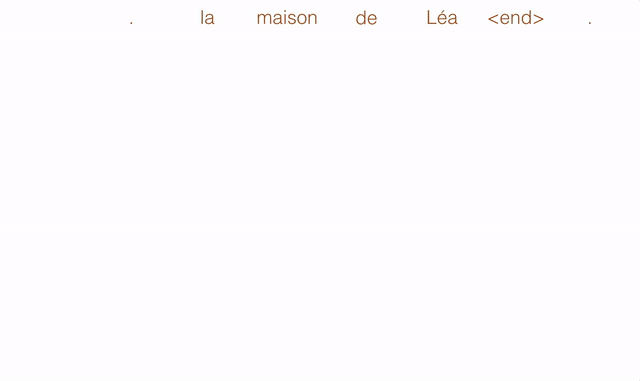

##   論文出處 : [Convolutional Sequence to Sequence Learning](https://arxiv.org/abs/1705.03122)

這篇是Facebook AI Research在ICML2017年中發表的，轟動一時。原因是這是緊接著Google發表GNMT之後，並且就是以google發表的gnmt當作bench mark，頗有叫陣的意味。其中亮點是不同於以往基於LSTM的Seq2seq架構，而是基於CNN，文內指出除了表現上也是達到SOTA外，訓練速度因為CNN架構性質導致遠遠超過LSTM base的架構。

閱讀這篇前需要的背景知識：
*   Seq2seq
*   CNN
*   RNN(LSTM, GRU.....)

雖然這篇不是用RNN的架構，但是我認為必須知道以往RNN的架構，才能看出這篇的差別。

## Introdution

Seq2seq顧名思義就是input和output都是序列，也就是有所謂的時間順序，一般來說利用RNN來實現這個架構。本文不同的是，他們採用CNN架構。但是傳統我們想到的CNN並無法處理序列資料，故需要一些特殊的結構讓CNN也可以處理序列問題，這在後面會詳細解釋。除此之外，因為CNN並不用像RNN每個time step都要等上一個time step結束才可以計算，所以使用CNN結構可以更有效率地利用平行計算大幅度減少訓練時間。在本文中，採用Multi-layer convolutional neural networks架構，使得在考慮某一長度時間的資訊時的時間複雜度也大大減少：$$O(\frac n k)$$ vs $$O(n)$$

## Convolutional Architecture

最上方是Encoder，左下方是Decoder的input端，左下方是Decoder的ouput端。

### Position Embeddings

首先，將input的句子中的每個字 $$\textbf x = (x_1,....., x_m)$$ 經由一個embedding matrix $$\mathcal D \in {\mathbb R}^{V \times f}$$ 轉成word vector，得到 $$\textbf w = (w_1,....., w_m)$$。其中 $$w_j \in {\mathbb R}^f$$，代表的是一個word vector具有dimension = $$f$$, $$ \mathcal D$$是代表字典大小為$$V$$、每個字為dimension = $$f$$的embedding matrix。

接著，對每個字做position embedding $$\textbf p = (p_1,....., p_m)$$，這個動作的用意是CNN架構運作方式不同於LSTM架構，並不是一造時間點一個一個做處理，而是並行處理，然而每個字在一個句子中如果位置不同，往往代表著不同的資訊。其中 $$p_j \in {\mathbb R}^f$$。

現在對於每個字$$x_j$$，得到$$w_j$$和$$p_j$$，分別代表著字詞的意義以及位置的資訊。在這邊是直接把兩個相同維度的向量相加得到 $$\textbf e = (w_1+p_1,...., w_m+p_m)$$，而之後會把這個向量$$e$$當作cnn的input。當然這也有其他做法，像是我讀到的很多task在這邊會直接把兩個vector concate起來。對於output也是用相同的方式處理得到 $$\textbf g = (g_1,....,g_n)$$。

### Convolutional Block Structure

首先我們定義：
*   Decoder的第 $$l$$ 層Convolutional Block的ouput為：

$$\textbf h^l = (h_1^l,..., h_n^l)$$

*   Encoder的第 $$l$$ 層Convolutional Block的ouput為：

$$\textbf z^l = (z_1^l,..., z_m^l)$$

每個Block包含一個一維Convolution,以及後面接著一個non-linearity單元。舉例來說，若有一個Conv Block，其kernel的寬度為 $$k$$ ，則他的ouput隱含著 $$k$$ 個input element的資訊。每個Convolution kernel的參數可表示如下：

$$W \in \mathbb R^{2d \times kd}$$

$$b_w \in \mathbb R^{2d}$$

而他們的input 
$$X \in \mathbb R^{kd}$$是將 $$k$$ 個dimension為 $$d$$ 的vector concate而得。經過Conv作用後，得到輸出：

$$Y \in \mathbb R^{2d}$$

可以看到，這時候的輸出 $$Y = [A B] \in \mathbb R^{2d}$$ 的維度是輸入的兩倍，用意是要當作non-linearity的輸入。這邊選擇gated linear units(GLU)當作non-linearity。GLU詳細機制可參考同是本篇作者群在2016發表的[
Language Modeling with Gated Convolutional Networks](https://arxiv.org/abs/1612.08083)。
加入GLU的用意我是理解為，他們是想要實現類似LSTM的Forget get之類的機制，決定有什麼資訊是有用的可以傳遞下去或是冗餘的。

以下用 $$\upsilon$$ 表示GLU：

$$\upsilon ([AB]) = A \otimes \sigma (B)$$

其中 $$A,B \in \mathbb R^d$$代表著GLU的兩個input，他們其實分別就是Conv的輸出 $$Y \in \mathbb R^{2d}$$的兩個維度。而 $$\otimes $$通常表示著element wise的相乘。 $$\sigma (B)$$ 代表著一個 "gate" ，決定哪個 A 是需要傳遞下去或是被擋下來的。GLU的 ouput 會是 $$ Y $$的一半：

$$\upsilon ([AB]) \in \mathbb R^d$$

這其實就會讓整個block的輸出和輸入都是 $$R^d$$ ，讓block的結構可以互相串疊。另外，因為多層的結構，可能會有exploding gradient和 vanishing gradient的問題，故加入residual connection的結構：

$$h_i^l = \upsilon(W^l[h_{i-k/2}^{l-1},....,h_{i+k/2}^{l-1}]+b_w^l)+h_i^{l-1}$$

上式代表第 $$l$$ 層的output是由第 $$l$$ 層Conv的output加上第 $$l-1$$層的output。並且第 $$l$$ 層的output會是第 $$l+1$$ 層的input，以此類推。

這邊有個細節：為了保證Conv的輸出長度和輸入是相同的，會在每層的input做padding，Encoder的部分如下圖：

但是在Decoder，為了不讓某個時間點看到該時間點以後的資訊，會有稍微不同的結構：假設kernel size為 k ，則在input 前後 pad (k-1) 的單位，最後把後端的k個單位刪除。如下圖（k=3）：

以上大概是完多層Conv架構的脈絡，接下來是最後輸出的部分。因為是語言模型，常以以下條件機率式表示最終輸出：

$$p(y_{i+1}|y_1,...,y_i, \textbf x) = softmax(W_o h_i^L + b_o) \in \mathbb R^T$$

其中假設最上層(第 $$L$$ 層)block的ouput為 $$h_i^L$$。

### Multi-step Attention

以下為計算attention的方式

$$d_i^l = W_d^lh_i^l + b_d^l + g_i$$

其中上標 $$l$$ 代表第幾層、下標 $$i$$是 time step、$$g_i$$ 是上一個時間點 $$i-1$$ 的target embedding，$$h_i^l$$是第l層的decoder ouput。

接著，計算權重分數方式如下：

$$a_{ij}^l = \frac {exp(d_i^l \cdot z_j^u)}{\sum_{t=1}^m exp(d_i^l \cdot z_t^u)}$$

$$a_{ij}^l$$表示在第 $$l$$層的第 $$i$$個time step，對於第 $$j$$個source element的權重分數。其中 $$z_j^u$$代表在Encoder最後一層 $$u$$中第 $$j$$個output。最後，計算 conditional input $$c_i^l$$：

$$c_i^l = \sum_{j=1}^{m} a_{ij}^l (z_j^u + e_j)$$

這個可以想成一般attention的context vector。比較不一樣的是一般attention在權重加總的時候只會考慮到 $$z_j^u$$，而這邊是再把最一開始的word embedding $$e_j$$加上之後才做weighted sum。好處是除了考慮到input經過理解計算後的$$z_j^u$$之外，也考慮到字詞本身獨立存在時的意義 $$e_j$$。在每層的attention計算完成後：

$$h_i^l = c_i^l + h_i^l$$

得到第 $$l$$ 層的ouput。這種多層多階段的attention機制在其他地方也被提過，叫做multi-hop attention。下圖用動畫更具體的示意attention的流程。

## Conclusion

FAIR在這邊引入了第一個完全基於CNN架構的seq2seq模型，打破了以往認為只能用lstm實現的框架，並且也獲得了很好的成績，而且CNN架構的訓練速度會比傳統LSTM架構快上許多，或許除了翻譯模型，在其他任務上也可以考慮用CNN-Seq2seq來實現。當然這篇很明顯是對google叫板，google也不會示弱，故在這邊提出之後沒幾個月，google馬上提出 [Attention is all you need](https://arxiv.org/abs/1706.03762)做回應，有興趣可不妨研究一下這篇。